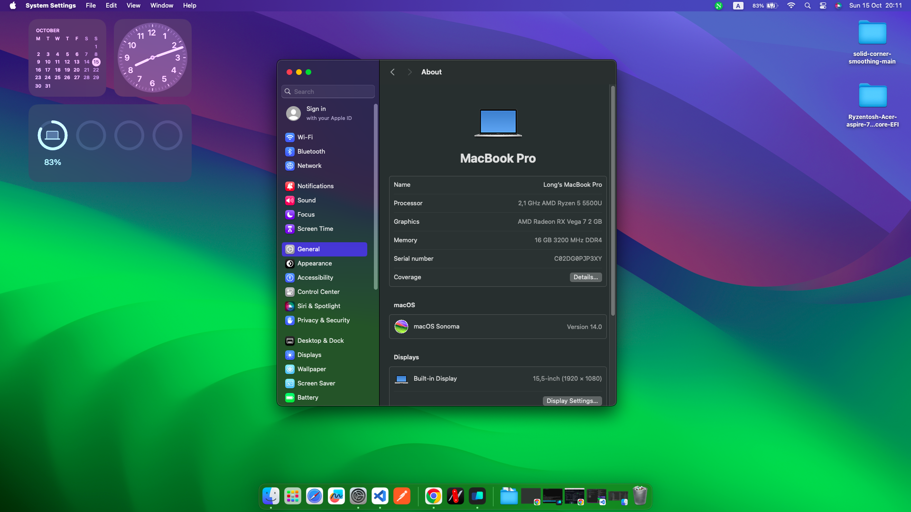
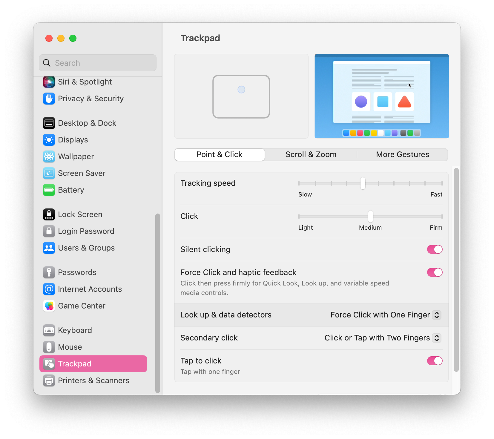

# Laptop Acer Aspire 7 Gaming

## SYSTEM

|                   |                                |
| ----------------- | ------------------------------ |
| Processor:        | AMD Ryzen 5 5500U (APU Mobile) |
| Memory:           | 8GB x 2                        |
| Graphics:         | AMD Radeon RX Vega 7 (Renoir)  |
| Wireless Network: | Intel AX210                    |
| Strorage:         | WD SN530                       |
| Audio:            | Realtek ALC255                 |
| Camera:           | HD User Facing                 |

## Setup EFI

Edit the `refind.conf` configuration in `EFI/BOOT/refind.conf` according to the EFI partition on your computer

## Installation Instructions

1. Setup bios: Disable fast boot, disable secure boot
2. Disable kext "NootedRed.kext", after the setup process after installing MacOS and then turning it back on
3. Install HoRNDIS-9.2.pkg (used to share ethernet from android phone)
4. Fix headphones and internal microphone error
   - https://github.com/longluuly/AppleALC
5. Fix External microphone (Headphone microphone) \
   5.1. Extract ComboJack-master.zip \
   5.2. Open ComboJack_Installer \
   5.3. Run `./install` in Terminal \
   5.4. After every time you plug in a headphone, a notification will appear. Please select "Headset" for the headphone microphone to work
6. Increase nvram using https://github.com/DavidS95/Smokeless_UMAF (Optional)

## What's working:

- Wi-Fi/Bluetooth (Intel AX210)
- USB Ports, USB-C
- Keyboard
- Trackpad I2C, gestures ~~(works in polling mode~~, support full now, kext get from nootedred)
- Audio
- Headphones
- Internal Microphone: working with fork of https://github.com/qhuyduong/AppleALC, my fork fix headphones https://github.com/longluuly/AppleALC
- External Microphone (headphone micro) woking with https://github.com/hackintosh-stuff/ComboJack
- Internal graphics acceleration (vcn is currently disabled for bug fixes, kext get from nootedred)
- Control brightness, sound and touchpad via keyboard keys
- Battery Status
- Inbuilt Camera
- CPU, iGPU
- Monitor CPU, GPU temperature
- HDMI: (working, connected to iGPU not GTX1650)

## What's Not Working:

- ~~GTX 1650:~~ (Not supported in MacOS)
- ~~Internal Microphone: (currently not working)~~ Fixed -> working
- ~~Fans control:~~ (currently not working)

## Unknown things:

- Headphones: ~~(I didn't test it)~~ Fixed -> working
- Sleep: (same as above)

## SCEENSHOTS:

