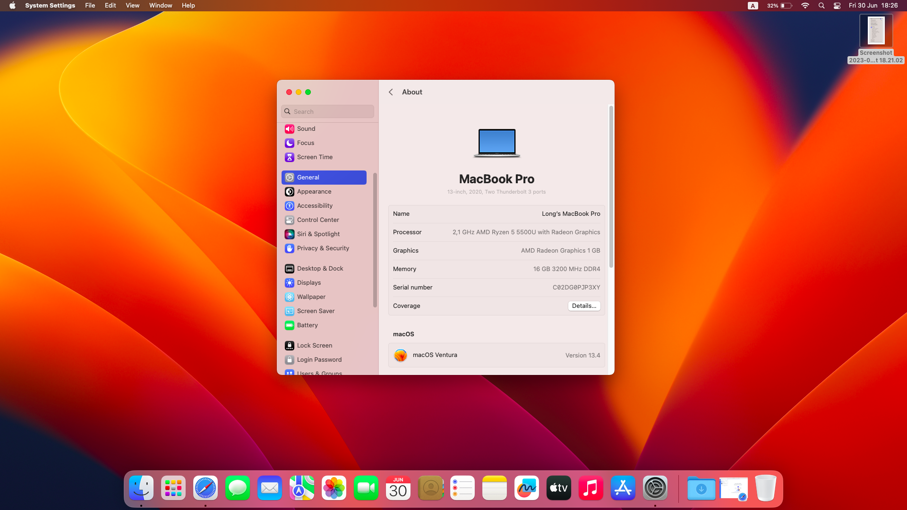
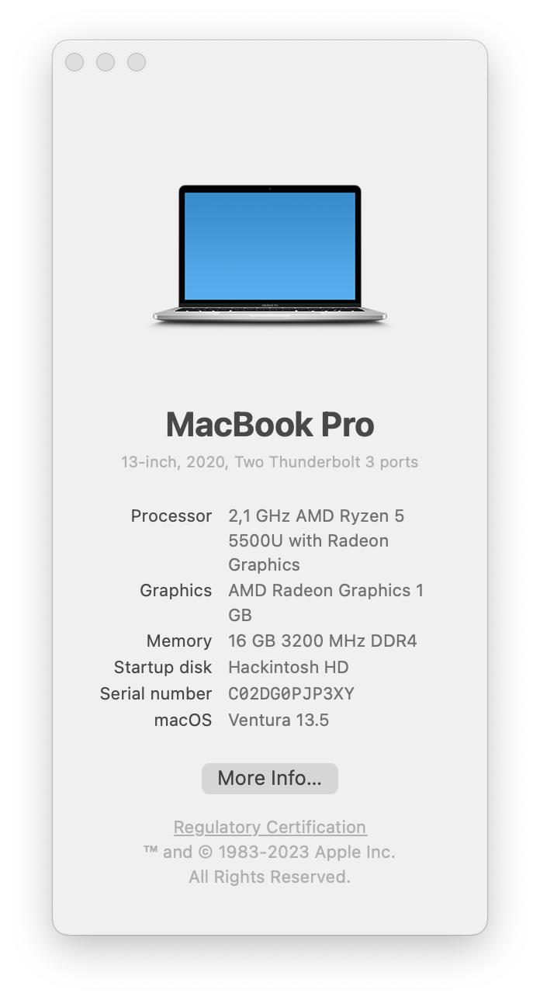
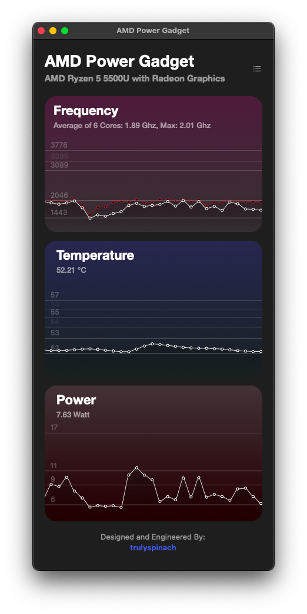
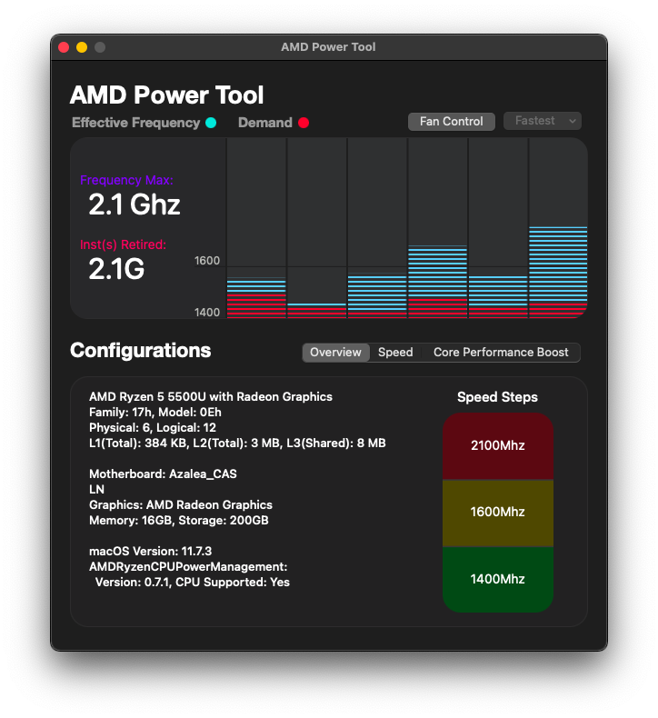

# Laptop Acer Aspire 7 Gaming

## SYSTEM

|                   |                                |
| ----------------- | ------------------------------ |
| Processor:        | AMD Ryzen 5 5500U (APU Mobile) |
| Memory:           | 8GB x 2                        |
| Graphics:         | AMD Radeon RX Vega 7 (Renoir)  |
| Wireless Network: | Intel AX210                    |
| Audio:            | Realtek ALC255                 |
| Camera:           | HD User Facing                 |

# Tested on bigsur and monterey

## What's working:

- Wi-Fi/Bluetooth (Intel AX210)
- USB Ports, USB-C
- Keyboard
- Trackpad I2C, gestures ~~(works in polling mode~~, support full now, kext get from nootedred)
- Audio
- Headphones
- Internal graphics acceleration (vcn is currently disabled for bug fixes, kext get from nootedred)
- Control brightness, sound and touchpad via keyboard keys
- Battery Status
- Inbuilt Camera
- CPU, iGPU
- Monitor CPU, GPU temperature

## What's Not Working:

- ~~GTX 1650:~~ (Not supported in MacOS)
- ~~Mic:~~ (currently not working)
- ~~HDMI:~~ (not working, connected to GTX 1650)
- ~~Fans control:~~ (currently not working)

## Unknown things:

- Headphones: ~~(I didn't test it)~~ Fixed -> working
- Sleep: (same as above)

## SCEENSHOTS:

